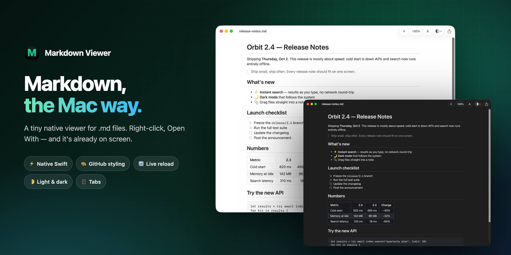
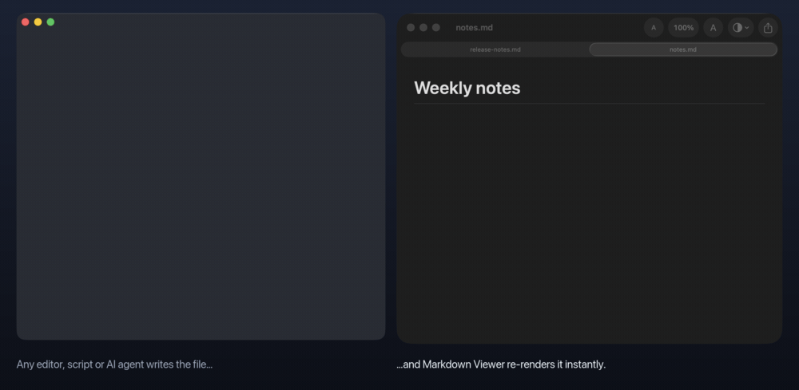
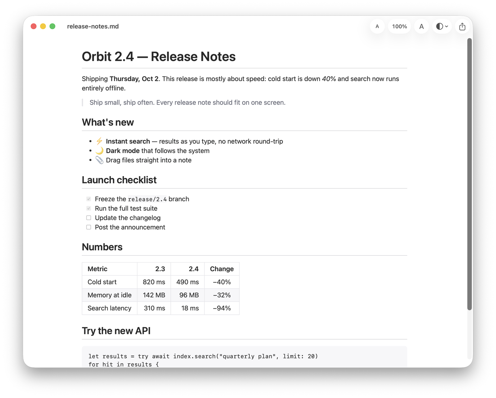
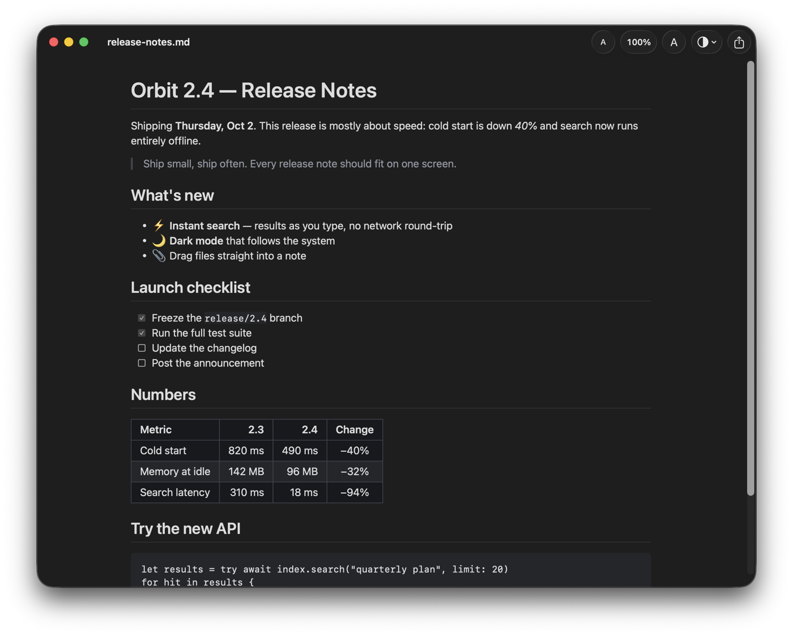
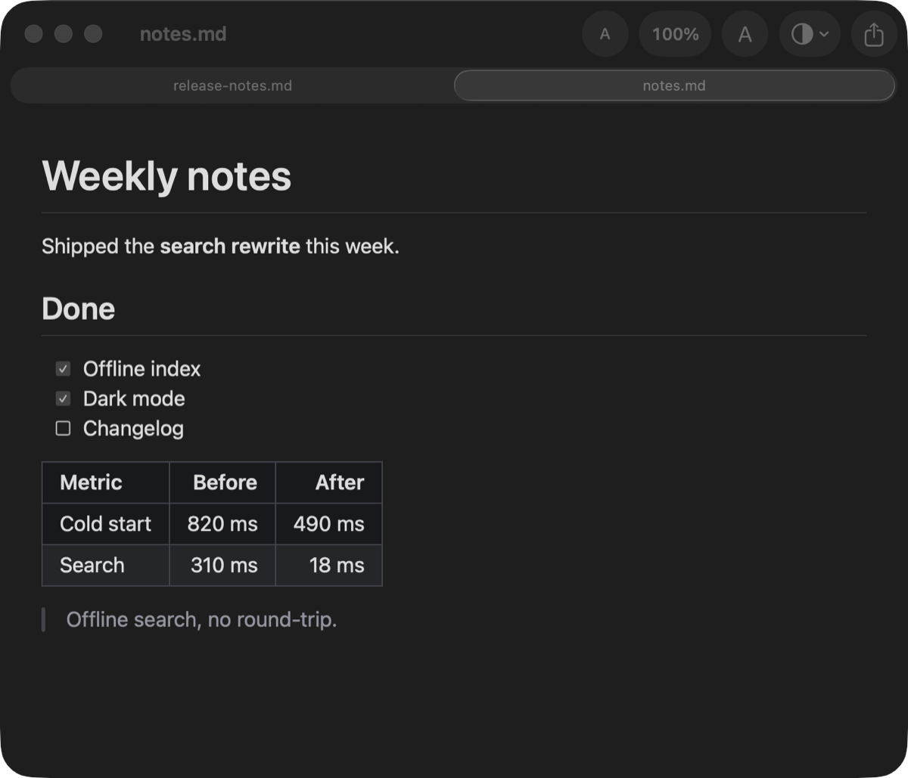
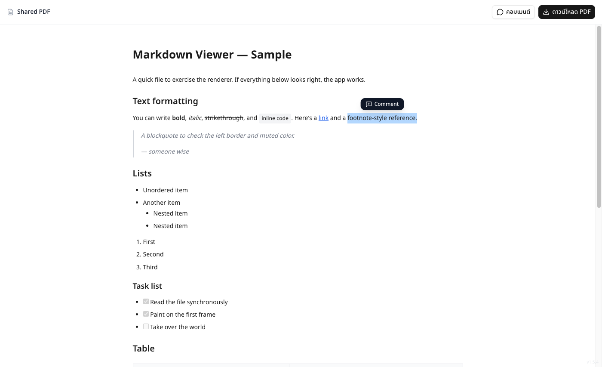

<div align="center">



# Markdown Viewer

**A tiny, native macOS app for reading Markdown.**<br>
Right-click a `.md` file → **Open With** → it's on screen before you've let go of the mouse.<br>
GitHub-styled, live-reloading, about 600 lines of Swift. No Electron, no account, no subscription.

[](LICENSE)
[](#requirements)
[](Package.swift)
[](Sources/MarkdownViewer)
[](Package.swift)

**[⬇ Download for macOS](https://github.com/tlejay/markdown-viewer/releases/latest)** · Apple Silicon + Intel · 1.8 MB

[What you get](#-what-you-get) · [See it in action](#-see-it-in-action) · [Install](#-install) · [Build from source](#-build-from-source) · [Make it yours](#-make-it-yours)

</div>

---

## ✨ What you get

| Feature | What it does |
|---|---|
| 📂 **Finder integration** | Shows up under right-click → **Open With** for `.md`, `.markdown`, `.mdown`, `.mkd` and plain text. Set it as the default with **Get Info → Change All…** |
| ⚡ **Native, fast cold start** | Swift + SwiftUI, no web view. The file is read synchronously and painted on the first frame; file watching starts *after* you can see the page |
| 🎨 **GitHub styling** | Headings, tables, task lists, blockquotes, code blocks and images via [`swift-markdown-ui`](https://github.com/gonzalezreal/swift-markdown-ui)'s GitHub theme |
| 🔄 **Live reload** | Edit the file in any editor — or let a script or AI agent write it — and the view updates itself. Handles editors that save atomically |
| 🌓 **Light / Dark / System** | Pick from the toolbar or the View menu. Your choice is remembered |
| 🔠 **Font zoom** | `⌘ +` / `⌘ −` / `⌘ 0`, from 60% to 260%, shared across windows |
| 🪟 **Window tabs** | Every file you open joins one window as a native tab, regardless of your system tab setting |
| 🔏 **No Developer account needed** | Ad-hoc signed by a plain shell script. `make install` and you're done |

## 🎬 See it in action

<div align="center">

</div>

Live reload, for real: every line the terminal writes to `notes.md` shows up rendered in the viewer a moment later. Same thing happens when you hit save in VS Code, Vim, Sublime — or when Claude Code is writing docs for you.

## 🌓 Light, dark, tabs

<table>
<tr>
<td width="50%"></td>
<td width="50%"></td>
</tr>
<tr>
<td align="center">Light</td>
<td align="center">Dark</td>
</tr>
</table>

<p align="center"><br><sub>Open several files — they stack up as tabs in one window.</sub></p>

## 🤔 Markdown Viewer or something else?

| | Markdown Viewer | Quick Look (spacebar) | Editor preview (VS Code, etc.) | Full Markdown apps (Typora, MacDown, …) |
|---|---|---|---|---|
| Renders Markdown | ✅ GitHub style | Plain text by default (needs a plugin) | ✅ | ✅ |
| Opens from Finder in one click | ✅ | ✅ | Opens the whole editor | ✅ |
| Live reload from other apps | ✅ | ❌ | ✅ inside the editor | Varies |
| Edit the file | ❌ read-only by design | ❌ | ✅ | ✅ |
| Export to PDF / HTML | ❌ (see [Make it yours](#-make-it-yours)) | ❌ | Via extensions | ✅ |
| Size of the code you'd fork | ~600 lines of Swift | — | — | Large |

If you write Markdown all day, a real editor is the better tool. Markdown Viewer is for the other moment: **you just want to read the file.**

## Start with Why

There is no shortage of Markdown apps. Some are heavy editors that take a full second to boot. Some are Electron wrappers that eat hundreds of megabytes of RAM to show a page of text. Some render beautifully but hide it behind a subscription, an account, and a splash screen.

None of them felt right for the one thing I do most: **glance at a `.md` file.**

I didn't want to write. I didn't want to sync. I just wanted to double-click a file and *read it*, styled the way GitHub styles it, as fast as hitting the spacebar on a photo in Finder.

So I built the smallest possible thing that does exactly that — and nothing else.

This isn't here to solve a problem for the whole world. It's here as a clean, honest starting point: a real native macOS app, small enough to read in one sitting, that you can fork and shape into whatever *your* ideal Markdown viewer looks like.

## ⬇ Install

1. Download **`Markdown-Viewer-1.0.0-macOS.zip`** from [Releases](https://github.com/tlejay/markdown-viewer/releases/latest) and unzip it.
2. Drag **Markdown Viewer — madebytle.com** into `Applications`.
3. The first time, **right-click the app → Open** (see [Gatekeeper](#a-note-on-gatekeeper) below).

Then in Finder: right-click any `.md` file → **Open With → Markdown Viewer — madebytle.com**.
To make it permanent: select a `.md` file → **Get Info → Open with → Markdown Viewer → Change All…**

## 🛠 Build from source

### Requirements

- macOS 13 (Ventura) or later
- Swift toolchain — either full Xcode **or** just the Command Line Tools (`xcode-select --install`). No Xcode project, no `xcodebuild`.

```bash
git clone https://github.com/tlejay/markdown-viewer.git
cd markdown-viewer

# Build the .app, then install to ~/Applications and register with Finder
make install
```

### Other commands

```bash
make build    # just build "dist/Markdown Viewer — madebytle.com.app"
make run      # build and launch
make dev      # fast debug run during development (swift run)
make clean    # remove build artifacts
```

## A note on Gatekeeper

Because there's no paid Developer ID signing, this app is **ad-hoc signed**. On the machine that built it, it just runs. On any *other* Mac — including when you download it from Releases — macOS will block it the first time. Right-click the app → **Open**, or run:

```bash
xattr -dr com.apple.quarantine "/Applications/Markdown Viewer — madebytle.com.app"
```

(Use `~/Applications/…` if that's where you put it.) This is expected for any self-signed app and is not a bug.

## How it's laid out

```
Sources/MarkdownViewer/
  MarkdownViewerApp.swift   # @main App — DocumentGroup gives open/tabs/windows for free
  MarkdownDocument.swift    # read-only FileDocument (synchronous, cheap)
  DocumentView.swift        # the reading surface (MarkdownUI + toolbar + window tabs)
  FileWatcher.swift         # DispatchSource-based live reload (survives atomic saves)
  AppSettings.swift         # persisted font scale + appearance
  SettingsView.swift        # Preferences window (⌘,)
  ShareService.swift        # optional: post the document to a share endpoint
  ShareSettings.swift       # share endpoint URL + API key (key lives in the Keychain)
  Keychain.swift            # tiny Keychain wrapper
Resources/Info.plist        # document types → this is what enables "Open With"
scripts/build.sh            # compile → assemble .app → ad-hoc sign
scripts/install.sh          # copy to ~/Applications + lsregister
scripts/make-icon.swift     # draws the app icon in code (no image assets)
```

## 🧩 Make it yours

The whole point. Some starting ideas:

- A sidebar table of contents generated from the headings
- Syntax highlighting for code blocks (MarkdownUI supports a `CodeSyntaxHighlighter` — plug in [Splash](https://github.com/JohnSundell/Splash) or similar)
- Your own `Theme` in `DocumentView.swift` (swap `.gitHub` for a custom palette)
- Export to PDF / HTML
- Find-in-page (`⌘F`) that scrolls to and highlights matches

Fork it, break it, make it the viewer *you* always wanted.

## Optional: share as a public link

There's a share button in the toolbar that posts the current document to a web endpoint and copies back a public URL — whoever opens it gets the page in the browser, downloadable as a PDF, with inline comments.



**This needs a server you control.** Out of the box it points at the author's own site (`kit.madebytle.com`), which requires a private API key — so for most people the button will just ask for a key. To use it yourself, run an endpoint that accepts `POST /api/md-to-pdf/share/external` with `Authorization: Bearer <key>` and a JSON body `{"markdown": "…"}`, and replies `{"url": "…"}`. Then set the URL and key in **Settings (`⌘,`)**. The key is stored in your Keychain. Or delete the button — the viewer doesn't need it.

## Contributing

Issues and pull requests are welcome. Keep it small: the goal is a viewer you can read end to end in one sitting, so features that add a lot of code are better as forks.

## License

MIT — see [LICENSE](LICENSE). Built by [Tle](https://madebytle.com).

<div align="center">
<br>
If this saved you from opening a whole editor just to read a README, a ⭐ helps other Mac folks find it.
</div>
